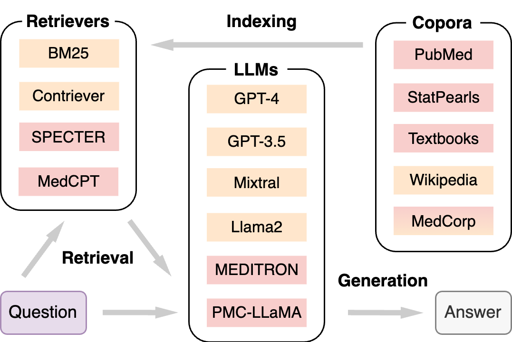

# FLARE-Med

**FLARE‑MedRAG** is a retrieval‑augmented generation (RAG) framework for medical question answering that combines an **iterative follow‑up loop** with **look‑ahead retrieval** to strengthen LLM reasoning. In our experiments, FLARE‑MedRAG boosts answer accuracy from 72-85% with a vanilla RAG baseline to 75-87%.

## Baseline

FLARE‑Med builds on **MedRAG**—a domain‑specific RAG pipeline that supports multiple corpora, retrievers, and LLM back‑ends:



## Innovations

FLARE-Med introduces two additional ideas:

1. **Iterative RAG**: The system runs for a fixed number of rounds. In each round, the LLM proposes several follow‑up queries, generates answers for them, and appends every Q‑A pair to the growing context.
2. **Look‑ahead retrieval**: Before answering each follow‑up query, the LLM generates a short “peek” of reasoning. That text is merged into the query, and a second retrieval pass fetches higher‑quality snippets.


## Effectiveness

Our FLARE-Med system, which incorporates both iterative RAG and look-ahead retrieval, consistently outperforms MedRAG. This demonstrates the effectiveness of our multi-hop retrieval augmentation strategy in expanding relevant context and supporting complex reasoning.

| Method                 | MMLU‑Med         | MedQA‑US         | BioASQ‑Y/N       |
| ---------------------- | ---------------- | ---------------- | ---------------- |
| Chain‑of‑Thought (CoT) | 86.87 ± 1.02     | 77.14 ± 1.18     | 83.01 ± 1.51     |
| MedRAG                 | 85.12 ± 1.08     | 77.30 ± 1.17     | 72.49 ± 1.80     |
| **FLARE‑Med**          | **87.88 ± 0.99** | **83.03 ± 1.05** | **75.24 ± 1.74** |

## Installation

```bash
# 1. Set your OpenAI key in MedRAG/src/config.py

# 2. Run the example script to test baseline, iterative, look-ahead, and FLARE-Med. The test result is stored in the folder Test/
python test_flaremed_example.py

# 3. Config the MedRAG variant in MIRAGE/src/config.json

# 4. Generate the answers on a MedRAG variant and evaluate the result
bash robust_run_benchmark.sh

# 5. Our experiment result is in results.md
```
